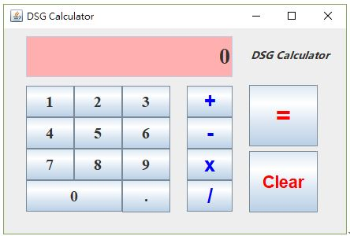
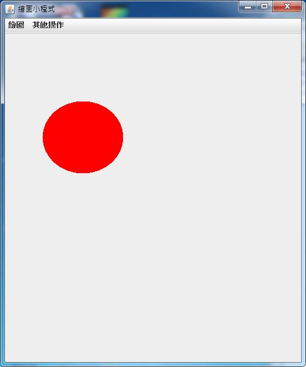

# 台南大學資工系程式設計作業
## 一年級 - 程式設計
### 第一學期: 
```
語言: C language
課本: Problem Solving and Program Design in C, 8th edition.
```
* 20240916:
    * CH02: 1, 3, 5, 6
    * CH03: 1, 9
* 20240923:
    * CH04: 2, 4, 11
* 20241014:
    * CH05: 1, 2, 13, 16, 17
    * CH06: 5, 8, 13
* 20241118:
    * CH07: 3, 5, 10, 12
    * CH08: 2
* 20241216:
    * CH09: 1, 2, 5
    * CH10: 5, 6

### 第二學期: 
```
語言: C++
課本: Walter Savitch, “Absolute C++,” Pearson International Edition, 6th Edition, 2016.
```
* 20250324:
    * CH06: 7, 8, 10, 12
    * CH07: 4, 8, 9
* 20250428:
    * CH08: 3, 6, 7
    * CH09: 4
* 20250512:
    * CH10: 4, 8
    * CH11: 2
* 20250526:
    * CH14: 1, 4, 9
    * CH15: 4, 7

## 二年級
### 第一學期: 物件導向程式設計
```
語言: JAVA
課本: JAVA How to Program (Early Objects), 11th edition, Paul Deitel and Harvey Deitel.
```
* 20250917:
    * CH02, CH03: 
        * page 154, 3.13, 3.14
    * CH04, CH05: 
        * page 210, 4.19
        * page 261, 5.16, 5.17
    * Ch06, CH07: 
        * page 372, 7.28
        * page 374, 7.31
* 20251022: excercise1
* 20251029: excercise2
* 20251119:
    * excercise2.5
    * excercise3
    * excercise4
    * excercise4.0
* 20251210: 
    * 延伸 app17_18.java，完成如附件之視窗介面。
    * 
* 20251224: 
    * 實作畫直線、橢圓填滿、矩形填滿的功能
    * 提供"橡皮筋"功能、移動已繪製的物件功能。
    * 直線黑色、橢圓紅色、矩形黃色。
    * 移動物件被選取後，顯示虛線的bounding box.
    * 利用MENU做功能選項。
    * 

### 第二學期: 網頁程式設計 (電機系)
```
語言: HTML, JavaScript, CSS, PHP
```
